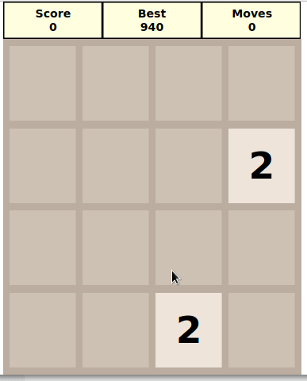
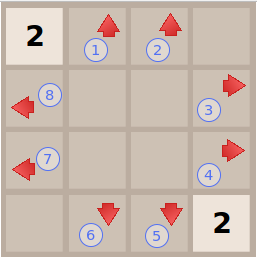

# 2048-beads

2048 em [beads](http://beadslang.org/)

O [fonte](https://guaracy.github.io/beads/sites/2048/2048_src.html) ficou com 181 linhas (incluindo brancos e comentários) e sem nada de html, css ou javascript (deixe a parte enfadonha para o compilador).

# Objetivo

O objetivo do jogo é juntar os blocos para formar um no valor de 2048. Entretanto, fazer isso não é tão fácil. Os blocos podem ser movidos na vertical ou horizontal. Quando nenhum bloco puder ser movido, o jogo encerra.

- os blocos são movidos na direção indicada até encontrarem o limite do tabuleiro ou um bloco com um número diferente do bloco movido.
- se o bloco encontrado for igual ao bloco em movimento, os dois se fundem somando o valor (a menos que o bloco tenha sido somado na mesma jogada).

# Movimentação

Use as setas para mover as peças. No celular clique nas posições 1 ou 2 para mover as peças para cima, 3 ou 4 para mover as peças para a direita, 5 ou 6 para mover as peças para baixo 7 ou 8 para mover as peças para a esquerda.

Para testar no seu computador (Firefox)

1. baixe o arquivo [2048](https://github.com/guaracy/2048-beads/releases/download/v1.0-RC/2048.zip), descompacte
2. abra o firefox e digite **about:config**
3. clique em **mostrar tudo** 
4. procure por **security.fileuri.strict_origin_policy** e mude para **false**
5. abra o arquivo 2048.html com o seu navegador.

Você também pode testar em [2048](https://guaracy.github.io/beads/sites/2048/2048.html)

Ou, instale [beads](http://beadslang.org/) no seu computador. Beads é para Macintosh ou Windows. Ainda não tem o compilador para Linux mas eu rodo no Linux utilizando o Wine e funciona perfeitamente. 
